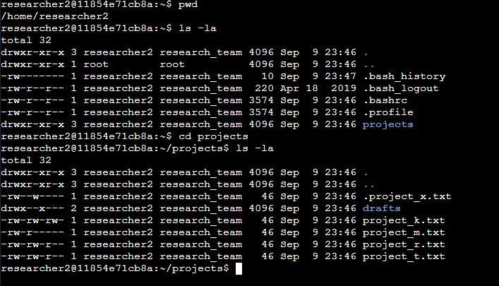
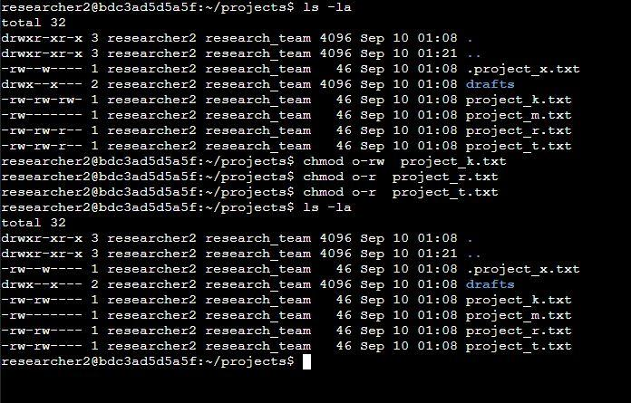
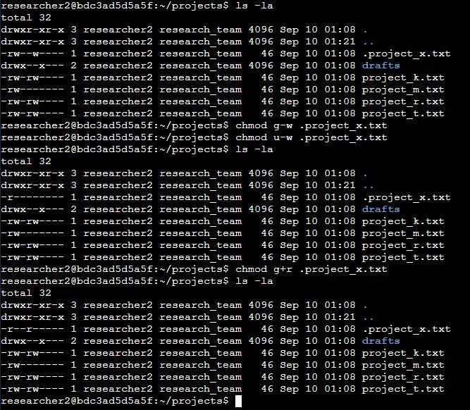
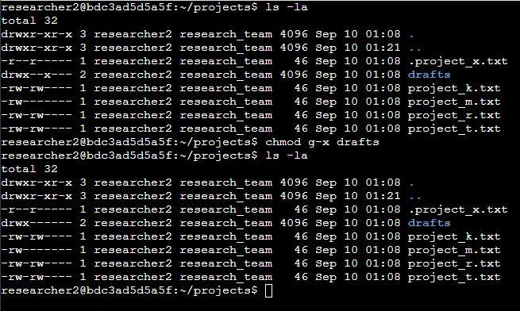

# File permissions in Linux

## **Project description**

This project examines how to identify existing permissions on a file system and how to determine if the permissions match the correct level of authorization that should be given to users and groups. The project also covers how to modify permissions and the methods used to authorize/unauthorize users depending on their required access.

## **Check file and directory details**

Using the command (**ls \-la**) displays all the permissions, group/owner names and file sizes inside the files and directories including hidden files (hidden files are identified via a period symbol). This command can also be split into two separate commands to either show or hide the hidden files. These commands are (**ls \-l**) for displaying non-hidden files, or (**ls \-a**) for displaying only hidden files.

## 

## **Describe the permissions string**

Breakdown of the first 10-character string using the following line as an example.

**drwxr-xr-x 3 researcher2 research\_team 4096 Sep  9 23:46.**

The first character indicates what type of file it is, with the “**d**” being for directory while a “**\-**“ represents a regular file. 

Example: **(d)**rwxr-xr-x 3 researcher2 research\_team 4096 Sep  9 23:46.

The second character displays the read permissions for the user. “**r**” indicates the user does have read permissions while a “**–**“ means the user is denied read permissions. 

Example: d**(r)**wxr-xr-x 3 researcher2 research\_team 4096 Sep  9 23:46.

The third character displays the write permissions for the user. “**w**” indicates the user does have write permissions while a “**–**“ means the user is denied write permissions. 

Example: dr**(w)**xr-xr-x 3 researcher2 research\_team 4096 Sep  9 23:46.

The fourth character displays the execute permissions for the user. “**x**” indicates the user does have execute permissions while a “**–**“ means the user is denied execute permissions. 

Example: drw**(x)**r-xr-x 3 researcher2 research\_team 4096 Sep  9 23:46.

The fifth character displays the read permissions for the group. “**r**” indicates the user does have read permissions while a “**–**“ means the user is denied read permissions. 

Example: drwx**(r)**\-xr-x 3 researcher2 research\_team 4096 Sep  9 23:46.

The sixth character displays the write permissions for the group. “**w**” indicates the user does have write permissions while a “**–**“ means the user is denied write permissions. 

Example: drwxr**(-)**xr-x 3 researcher2 research\_team 4096 Sep  9 23:46.

The seventh character displays the execute permissions for the user. “**x**” indicates the user does have execute permissions while a “**–**“ means the user is denied execute permissions. 

Example: drwxr-**(x)**r-x 3 researcher2 research\_team 4096 Sep  9 23:46.

The eighth character displays the read permissions for the user. “**r**” indicates the user does have read permissions while a “**–**“ means the user is denied read permissions. 

Example: drwxr-x**(r)**\-x 3 researcher2 research\_team 4096 Sep  9 23:46.

The Nineth character displays the write permissions for the user. “**w**” indicates the user does have write permissions while a “**–**“ means the user is denied write permissions. 

Example: drwxr-xr**(-)**x 3 researcher2 research\_team 4096 Sep  9 23:46.

The tenth character displays the execute permissions for the user. “**x**” indicates the user does have execute permissions while a “**–**“ means the user is denied execute permissions. 

Example: drwxr-xr-**(x)** 3 researcher2 research\_team 4096 Sep  9 23:46.

## **Change file permissions**

Commands used to remove unnecessary permissions from other:

- chmod o-rw project\_k.txt

- chmod o-r project\_r.txt

- chmod o-r project\_t.txt

## 

## **Change file permissions on a hidden file**

Commands used to remove write and add read permissions for group and user:

- chmod g-w .project\_x.txt  
- chmod u-w .project\_x.txt  
- chmod g+r .project\_x.txt

  

## **Change directory permissions**

Commands used to remove execute permissions from group:

- chmod g-x drafts

## **Summary**

The Linux commands above demonstrate how to examine existing permissions on the file system and how to verify that they match the correct level of authorization required for that user to fulfill their roles. As well as showing the processes needed to revoke or add any unnecessary or missing permissions depending on the user’s role. 	

